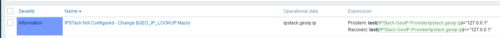
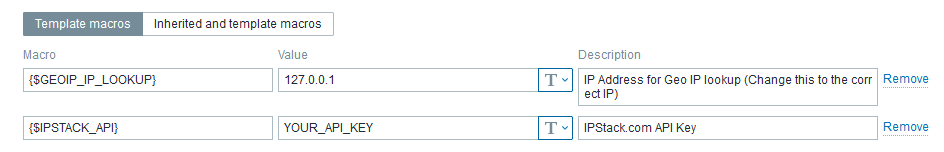
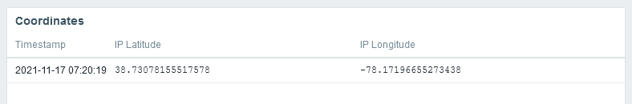
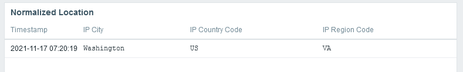
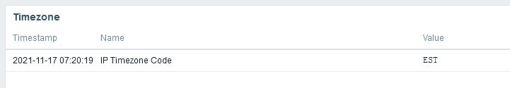
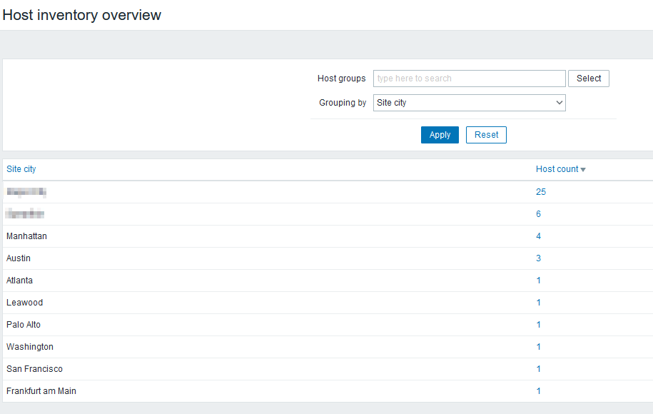
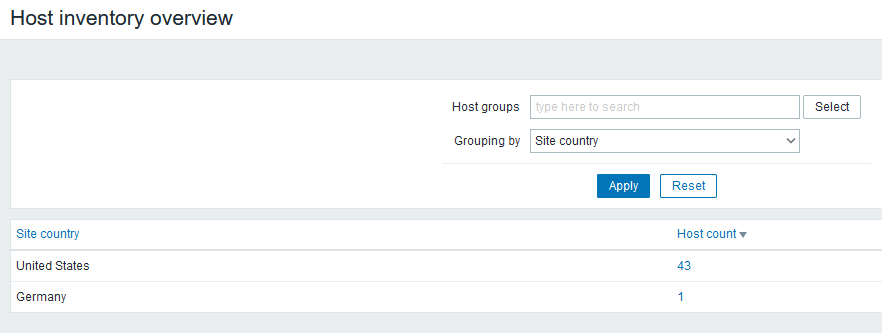
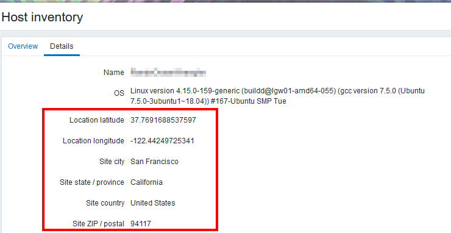

# Zabbix_GeoLocation
Geolocation Provider for Zabbix via IPStack API

## Installation
Import Zabbix_IPStack.yaml (Zabbix Template)
Link new Zabbix Template "	IPStack-GeoIP-Provider" to existing host.
Se host macro {$IPSTACK_API} your IPStack API Key - (https://ipstack.com/quickstart)
Set macro "{$GEOIP_IP_LOOKUP}" to the IP address associated with the host

## Items
- IP Location: Continent, Country, Region, City, Zipcode, Latitude, Longitude
- IP Location Currency: Currency Code, Currency Name
- IP Location Timezone: Timezone Code, ID, GMT Offset, Daylight Savings Time
- IP Connection: ASN, Internet Service Provider
- IP: IP, Type, Hostname
## Triggers
- If {$GEOIP_IP_LOOKUP} = 127.0.0.1, a non-classified trigger is configured to remind you to configure the macro.

## Dashboard
- Location Information: Quick Information for Normalized Location, Coordinates, Currency, and Timezone

# Screenshots
Triggers (IPStack not Configured)

Template Macros

Dashboard - Coordinates

Dashboard - Normalized Location 

Dashboard - Timezone

Dashboard - ASN

Host Inventory By City

Host Inventory By Country

Host Inventory Detail

# Updates

## November 17 2021
- Added screenshots
- Added tags to items

## Contact
Twitter: @KRelkci
GitHub: @Relkci

## Special Thanks
Black Hills Information Security
https://www.blackhillsinfosec.com